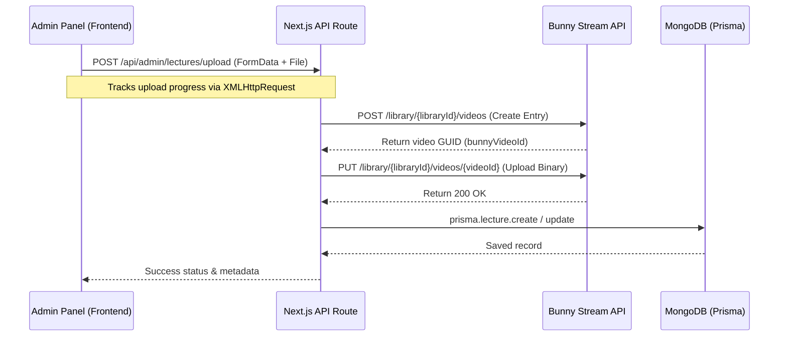
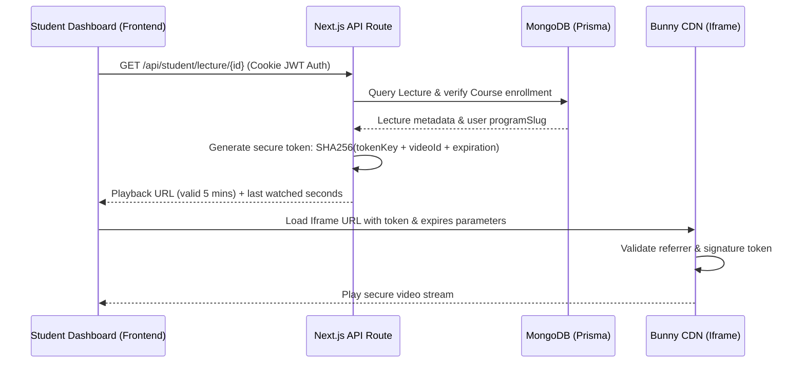

# Bunny Stream Secure Video Integration Documentation

This document explains the integration of Bunny Stream secure video hosting in the Emerging Edge School of Technology (EEST) LMS platform.

---

## 1. Bunny Stream Setup

Follow these steps in your Bunny.net dashboard to configure the video library:

1. **Create a Video Library:**
   - Log in to your Bunny.net portal.
   - Go to **Stream** in the sidebar and click **Add Video Library**.
   - Set a name (e.g., `eest-lectures`) and select a storage zone closest to your audience.

2. **Enable Token Authentication:**
   - Navigate to your video library settings.
   - Go to the **Security** tab.
   - Turn **ON** the option for **Enable Token Authentication**. This ensures direct HLS streams and iframe player requests cannot be loaded without a signed token signature.

3. **Configure Allowed Referrers:**
   - In the same **Security** tab under **Allowed Referrers**, add the following domains:
     - `https://school.emergingedge.tech`
     - `http://localhost:3000` (development)
     - `http://localhost:5173` (development)
   - Enable **Block direct access to video files** to prevent students from sharing/downloading CDN URLs directly.

4. **Retrieve Access Credentials:**
   - Go to your library Settings page to find the **Library ID** (under API settings).
   - Get the **API Key** (Access Key) from the **API** tab in the library dashboard.
   - Get the **Token Authentication Key** (Token Key) from the **Security** tab.
   - Find the **Pull Zone** hostname associated with your library (under General settings).

---

## 2. Environment Variables

Add the following variables to your local `.env.local` and your production environment hosting (e.g. Vercel, VPS):

```env
# Bunny Stream Secure Video Hosting Configuration
BUNNY_STREAM_LIBRARY_ID="your_library_id"
BUNNY_STREAM_API_KEY="your_api_key_access_key"
BUNNY_STREAM_PULL_ZONE="your_pull_zone_hostname"
BUNNY_STREAM_TOKEN_KEY="your_token_authentication_key"
```

---

## 3. Architecture & Flows

### A. Admin Upload Flow


### B. Student Playback Flow


### C. Watch Progress Flow
- The **VideoPlayer** registers a `message` listener on the parent window.
- When the Bunny Stream iframe is ready, it sends PlayerJS events (`ready`, `timeupdate`, `ended`, `pause`).
- The player automatically sends a `POST /api/student/progress` request containing `{ lectureId, watchedSeconds, completed }` to the database:
  - Periodically (every 5 seconds of play time).
  - Immediately on **pause**.
  - Immediately on **ended** (marking `completed: true`).
- When the student reopens the course page, it displays:
  - **Completed badge** (if `completed` is true).
  - **Resume Watching** hero block at the top if a lecture is partially watched.
  - Clicking any lecture resumes playback exactly from where they paused.

---

## 4. Code Quality & Integration Details

- **Clean Structure:** 
  - [bunny.ts](file:///t:/Summer%20Course%20Portal/src/lib/bunny.ts): Self-contained API helper class.
  - [video-player.tsx](file:///t:/Summer%20Course%20Portal/src/components/portal/video-player.tsx): Reusable component managing iframe integrations and postMessage callbacks.
  - [route.ts](file:///t:/Summer%20Course%20Portal/src/app/api/student/lecture/[id]/route.ts): Clean, secure endpoint that hides API secrets and signs URLs on-the-fly.
- **Production-Ready Security:**
  - Token expiration set to **5 minutes** (after which the token expires and is rejected, preventing shared links from working).
  - API Keys are only accessible server-side.
  - Allowed Referrers block unauthorized domain playback.

---

## 5. Deployment Steps

1. Push your updated Prisma schema to production:
   ```bash
   npx prisma generate
   ```
2. Set the variables `BUNNY_STREAM_LIBRARY_ID`, `BUNNY_STREAM_API_KEY`, `BUNNY_STREAM_PULL_ZONE`, and `BUNNY_STREAM_TOKEN_KEY` in your production environment settings (Vercel, AWS, etc.).
3. Redeploy the application.
4. Go to Bunny Stream settings and ensure the production domain `https://school.emergingedge.tech` is added to Allowed Referrers.
